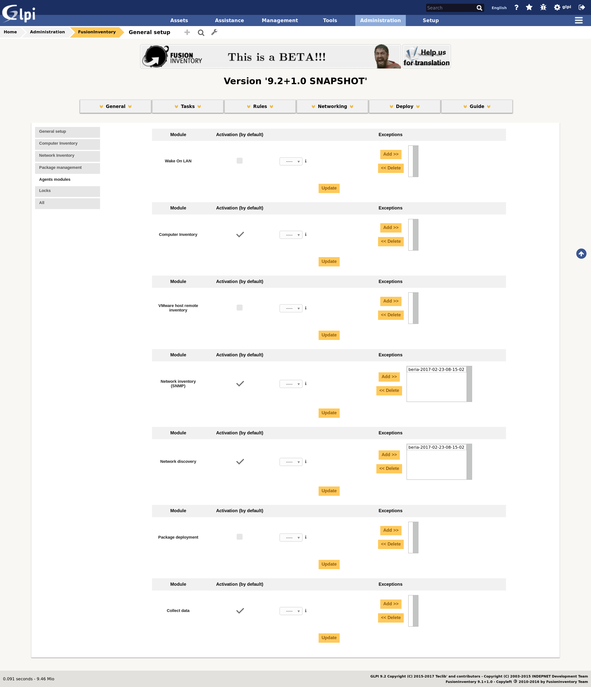

# Purpose

A network discovery task aims to scan the the network, and reports devices
found to the GLPI server, so they can be added to the list of known assets.

Once part of the list of known assets, further information can be retrieved
from SNMP-enabled devices using a [network inventory
task](networkinventory.html).

# Overview

This task uses the following protocols to scan IP networks:

* ICMP scan (if nmap is available)
* NetBIOS scan (if Net::NBName is available, and proper credits provided)
* SNMP scan (if Net::SNMP is available, and proper credits provided)

Any device replying to at least one of those protocols will be *discovered*,
with minimal information, such as mac address and hostname.

Additionaly, if the device replies to SNMP, the agent will attempt to identify
it, using various methods. The primary method relies on retrieving the value of
the dedicated SNMP variable (SNMPv2-MIB::sysDescr.0), wich is a
constructor-specific OID identifying a given device model, and comparing it to
the agent internal database (the sysobject.ids file). If a match is found,
model, type and manufacturer are added to the information reported to the GLPI
server, allowing simple identification. If no match is found, various
heuristics are performed in order to identify the device, with lower
reliability.

Discovered devices are then reported to the GLPI servers, and [import
rules](../fi4g/importrules.html) are applied.

# Running

## Pre-requisite

The agent performing the task needs to have the network discovery module
installed. Many Linux distributions ships agent modules in distinct packages,
to reduce the burden of dependencies. And the module itself has multiple
additional optional software dependencies, as noted earlier.

The agent performing the task needs network access the target networks, with
forementioned protocols, as well as control access, for SNMP: just being able
to send UDP packets to a device is not enough, if this device is configured to
ignore them.

As for any other server-controled task, the agent should use either managed or
half-managed mode, as explained in [agent usage](../agent/usage.html). If
the task is server-triggered, the agent must run in managed mode, and
its HTTP port should be reachable from the server.

## Manual execution

In order to run a network discovery task without a GLPI server, and for easier
troubleshooting, the fusioninventory-netdiscovery task can be run from command
line. See [fusioninventory-netdiscovery manpage]({{ site.baseurl }}/documentation/agent/man/fusioninventory-netdiscovery.html) for
details.

## Server execution

### Module activation

In order to assign a network discovery task to an agent, the network discovery
module needs first to be activated for this agent, as this is not the default.

#### Multiple agents

1. from the FusionInventory plugin welcome screen, select the _General_ >
  _General configuration_ menu item
1. select the _Agents modules_ tab

You can then either activate the module for any number of agents, and even
configure it to be activated by default, as illustrated by the following
screenshot.

#### Single agent

1. from the FusionInventory plugin welcome screen, select the _General_ >
  _Agents management_ menu item
1. select the specific agent in the list
1. select the _Agents modules_ tab

You can then activate the network discovery module for this agent, as
illustrated by the following screenshot.

### Target network creation

You now have to define an IP range item, corresponding to the the network to be
scanned:

1. from the FusionInventory plugin welcome screen, select the _Networking_ > _IP
ranges_ menu item

You can then create a new item, as illustrated by the following screenshot.

### Task creation

You now have to define a task, including a network discovery type job:

1. from the FusionInventory plugin welcome screen, select the _Tasks_ > _Task
   management_ menu item
1. create a new task, with an arbitrary name (for instance, discovery task), in
   active state, and save it (screenshot 1)
1. select _Jobs configuration_ tab
1. create a new job, with an arbitrary name (for instance, discovery job),
   using network discovery as module method, and save it (screenshot 2)
1. configure this job by assigning it a target (the IP range item create
   previously) and an actor (the elected agent), and update the current
   configuration (screenshot 3)

## Performance issues

### Credentials

Unfortunatly, there is no way to distinguish a failed SNMP authentication
attempt on a device, from the absence of a device. It means the agent will try
each available credentials against each IP address, in given order, and wait
for timeout each time. The most efficient way to adress this issue if to only
use the relevant set of credentials, and reduce the specific SNMP timeout.

### Threads number

In order to scan multiple addresses simultaneously, the agent can use multiple
discovery threads. This allow multiple simultaneous request, but also increase
resource usage on agent host. And also increase crash probability, if TLS is
used in any manner (including agent/server communication through HTTPS), as
perl TLS bindings are not 100% thread-safe. Unfortunatly, there is no way
currently to avoid thread usage totally, as current implementation always use
one controlling threads, in addition to a configurable number of working
threads.

# Troubleshooting

## The task doesn't run at all

## The task runs, but only reports unknown devices

## The agent crashes
